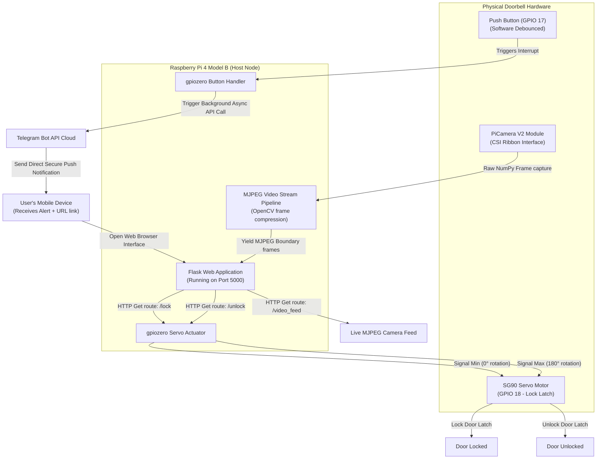

# 🚪 Raspberry Pi IoT Smart Doorbell

> An end-to-end smart home access control system utilizing a Raspberry Pi, custom Flask-based MJPEG video streaming server, physical button triggers with instant Telegram notifications, and a servo-actuated physical lock override.

<!-- 📸 Add a photo of your smart doorbell installation:  -->

---

## ⚡ Key Highlights

*   **Live Video Streaming:** Low-latency MJPEG video broadcast directly from the Raspberry Pi camera module to a custom Flask web interface via OpenCV (`cv2`).
*   **Instant Cloud Alerting:** Pressing the physical door button triggers an asynchronous background API call to the **Telegram Bot API**, delivering a secure link directly to the host IP.
*   **Web-Controlled Physical Override:** Two secure HTTP routes (`/lock` and `/unlock`) transition a robust **SG90 servo motor** acting as a physical sliding lock latch.
*   **Graceful Termination Architecture:** Custom Python `signal` listeners catch `SIGINT` (Ctrl+C) and `SIGTERM` signals to cleanly close button interrupts, shut down the servo, release the camera interface, and exit without leaving resources locked.

---

## 🏗️ System Architecture & Data Flow



---

## 🔌 Hardware Configuration & Pin Map

*   **Raspberry Pi 4 Model B (or equivalent SBC):** Main system host, managing the camera, button interrupts, servo actuation, and the Flask web service.
*   **PiCamera module:** Configured using the updated `picamera2` Python framework, streaming live frames at 640x480 resolution.
*   **Physical Doorbell Button:** Configured with `gpiozero.Button` on **GPIO 17** (with software debouncing).
*   **SG90 Servo (Lock Actuator):** Driven via pulse-width modulation from **GPIO 18** using `gpiozero.Servo`.

| Peripheral | Raspberry Pi Pin | Mode / Description |
|-----------|---|---|
| **Doorbell Button** | **GPIO 17** | Input, reads doorbell presses |
| **Servo Latch** | **GPIO 18** | Output (PWM), acts as lock control |
| **Pi Camera** | CSI Interface | Dedicated camera ribbon cable |

---

## 🧠 Core Software Logic

### 1. MJPEG Streaming Pipeline
Frames are continuously captured as raw NumPy arrays, compressed to JPEGs using OpenCV, and yielded as a multipart HTTP boundary stream:
```python
def generate_frames():
    while True:
        frame = camera.capture_array()
        ret, buffer = cv2.imencode('.jpg', frame)
        frame = buffer.tobytes()
        yield (b'--frame\r\n'
               b'Content-Type: image/jpeg\r\n\r\n' + frame + b'\r\n')
```

### 2. Telegram Bot Integration
When the doorbell button transitions to `pressed` (`button.when_pressed = doorbell_pressed`), the system sends an HTTP POST request to Telegram's cloud endpoint containing the local routing link:
```python
def send_telegram_message(message):
    bot_token = '7670195132:AAEsUMYr4w9...'
    chat_id = '5963355561'
    url = f"https://api.telegram.org/bot{bot_token}/sendMessage"
    payload = {'chat_id': chat_id, 'text': message}
    requests.post(url, data=payload)
```

---

## 📁 Project Structure

```
smart-doorbell/
├── app.py              ← Core Flask server & hardware control loop (83 lines)
├── templates/          
│   └── index.html      ← Bootstrap-styled live monitor web template
└── static/             ← System assets & styling overrides
```

---

## 🚀 Getting Started

### Prerequisites
1.  **Raspberry Pi OS** (Bullseye or later)
2.  Enable the camera interface in `raspi-config`
3.  Install system dependencies:
    ```bash
    sudo apt-get install python3-opencv python3-gpiozero
    pip install flask requests picamera2
    ```

### Running the App
1.  Connect the physical hardware to the specified GPIO pins.
2.  Run the Flask app:
    ```bash
    python app.py
    ```
3.  Press the physical button to receive a Telegram alert on your phone.
4.  Open the URL provided in the alert to monitor the live feed and control the lock interface.

---

## 🔬 Lessons Learned

1.  **MJPEG vs. H.264:** Streaming raw H.264 video requires heavy hardware encoding and causes notable latency. Switching to an **MJPEG multipart boundary stream** allowed low-latency 30fps video at 640x480 resolution, making it highly responsive for instant home-security checks.
2.  **GPIO Cleanup and State Protection:** Unclean terminations could leave the door lock servo powered, causing it to continuous jitter or stall, running up heat. Implementing `signal.signal(signal.SIGINT, cleanup_gpio)` ensures the servo is safely powered down (`servo.close()`) immediately when the program exits.

---

## 👤 Author
**Balaji Rayudu S**  
B.Tech Electronics & Computers Engineering  
Amrita Vishwa Vidyapeetham, Bengaluru  
